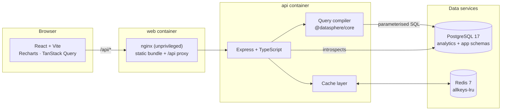
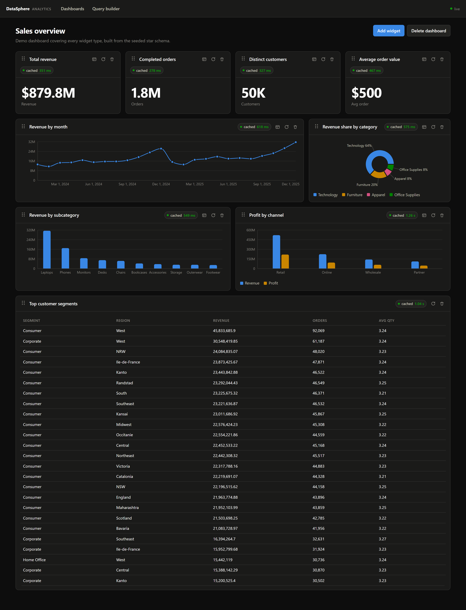
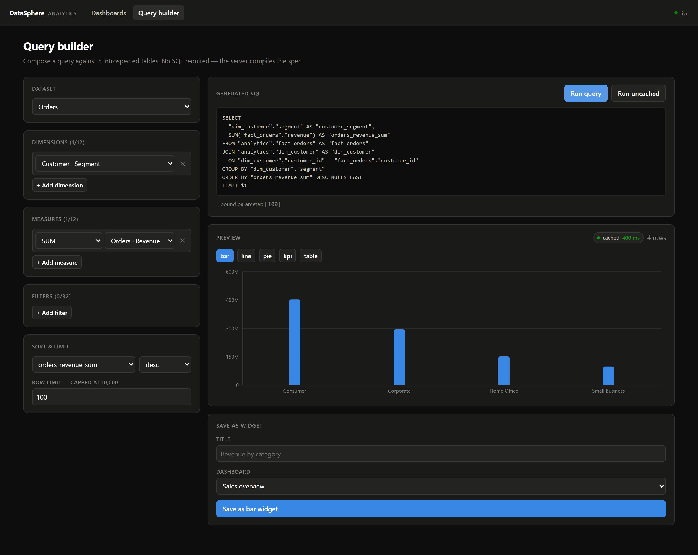

# DataSphere

[](https://github.com/kp-krish/DataSphere/actions/workflows/ci.yml)

A cloud data visualization platform. Users compose analytical queries through a
UI — no SQL — and DataSphere compiles that JSON spec into parameterised SQL,
runs it against a 2-million-row PostgreSQL star schema, caches the result in
Redis, and renders it as live dashboard widgets.

> **Status: complete.** The stack runs end to end, CI builds the images and
> smoke-tests the whole compose stack on every push, and the performance work
> is measured rather than asserted — see [BENCHMARKS.md](BENCHMARKS.md).

---

## Architecture



The **query compiler** is the security boundary. It lives in
`packages/core` as a pure, dependency-free function: a JSON query spec goes in,
`{ text, values }` comes out. Table and column names are validated against an
allowlist derived from introspecting the database, and every user-supplied
value becomes a bind parameter. Nothing is string-concatenated.

Schemas are split for the same reason:

| Schema      | Contents                                                              | Reachable by the query engine                  |
| ----------- | --------------------------------------------------------------------- | ---------------------------------------------- |
| `analytics` | `fact_orders`, `dim_date`, `dim_customer`, `dim_product`, `dim_store` | yes — the catalog introspects this schema only |
| `app`       | `dashboards`, `widgets`                                               | no                                             |

Application tables are structurally unreachable from a user-composed query,
independent of the allowlist check.

---

## Quick start

Requirements: Docker with Compose v2.

```bash
git clone https://github.com/kp-krish/DataSphere.git
cd DataSphere
cp .env.example .env
docker compose up --build
```

Then open <http://localhost:5173>.

Boot order is enforced with healthchecks, not sleeps:

```
postgres + redis  →  init (migrate + seed)  →  api  →  web
```

The `init` service runs migrations, generates 2M rows, and exits. The API waits
on `service_completed_successfully`, so it never starts against an unmigrated
or unseeded database. First boot takes roughly a minute; subsequent boots reuse
the volume and skip seeding entirely.

For a faster first run, seed less data:

```bash
SEED_FACT_ROWS=100000 docker compose up --build
```

### Local development

```bash
npm install
docker compose up -d postgres redis   # data services only
npm run migrate
npm run seed
npm run dev:api                       # http://localhost:4000
npm run dev:web                       # http://localhost:5173
```

---

## Dataset

A classic Kimball star schema modelling e-commerce order lines.

| Table          | Rows      |   Heap | Indexes |
| -------------- | --------- | -----: | ------: |
| `fact_orders`  | 2,000,000 | 206 MB |  297 MB |
| `dim_customer` | 50,000    | 6.2 MB |  1.1 MB |
| `dim_product`  | 5,000     | 768 kB |  344 kB |
| `dim_date`     | 1,826     | 144 kB |  112 kB |
| `dim_store`    | 200       |  24 kB |   16 kB |

The indexes on `fact_orders` outweigh the data they index. That is a real cost,
not an oversight — the reasoning for each one, and for the columns deliberately
left unindexed, is in
[the index migration](apps/api/migrations/20260823090000000_analytics_indexes.sql).

The generator is deliberately not uniform, because uniformly random data makes
every filter equally selective and produces benchmark numbers that do not
survive contact with real data:

- **Power-law popularity** for customers, products and stores
- **Seasonality**: monthly and weekday demand curves over 18% compounding
  annual growth, so time series show a real trend and date-range filters vary
  in selectivity
- **Price-coherent measures**: cost clusters around per-subcategory means and
  quantity scales inversely with price. Office Supplies leads on line count and
  trails on revenue; Technology inverts it.
- **Deterministic**: a given `SEED_RANDOM_SEED` reproduces the identical
  dataset on any machine, so benchmark runs are comparable

Loading uses `COPY FROM STDIN` streamed under backpressure at ~190k rows/s in
the container, with foreign keys dropped for the load and restored afterwards.

---

## Caching

Query results are cached in Redis under a key derived from the _normalised_
query spec, so two specs that mean the same thing share one entry — filters are
ANDed, for instance, so their order is sorted away before hashing.

Every response reports what the cache did, which is what makes the performance
claim checkable rather than asserted:

```jsonc
"meta": {
  "cache": "hit",          // hit | miss | bypass | disabled
  "executionMs": 0,        // Postgres was not touched
  "totalMs": 2.12,
  "savedMs": 317.12,       // what this hit actually saved, measured
  "cacheTtlRemaining": 287,
  "generation": 13
}
```

### Invalidation is O(1)

Each dataset carries a generation counter, and the generation is folded into
every cache key. Invalidating is a single `INCR`: every key written under the
old generation becomes unreachable at once, because nothing will ever compute
that key again. Orphans expire on their own TTL, or sooner under Redis's
`allkeys-lru`. No `SCAN`, no per-table key sets to keep in step.

Generations are held in process (they sit on the query hot path) and kept
current three ways: read at startup and on every Redis reconnect, pushed over
pub/sub the instant any instance invalidates, and re-read on a 30s timer as a
backstop for messages missed during an outage. If all three fail the worst case
is bounded — a cached result served until its own TTL expires, which is the
staleness the TTL already permits.

### Live updates

The same pub/sub feed drives `GET /api/events`, a Server-Sent Events stream.
When a dataset is invalidated, connected browsers are told immediately and
refetch — rather than every widget polling on a timer for data that has not
changed. `POST /api/demo/orders` appends synthetic order lines and invalidates
in the same request, which makes the whole loop demonstrable.

The cache is never load-bearing: every path through it degrades to "run the
query" when Redis is unavailable, and the response says `disabled` rather than
pretending the cache was consulted.

---

## API

JSON over HTTP, no authentication — this is a single-tenant demonstration
system. Every route is under `/api`, except the two probes, which are also
mounted at the root because container healthchecks hit the API port directly.

### Catalog

The catalog **is** the allowlist. A table or column absent from it cannot
appear in a compiled query, which is the mechanism the whole security argument
rests on.

| Method | Path                   | Purpose                                                  |
| ------ | ---------------------- | -------------------------------------------------------- |
| `GET`  | `/api/catalog`         | Datasets, tables, columns, types and the join graph      |
| `POST` | `/api/catalog/refresh` | Re-introspect immediately instead of waiting for the TTL |

### Query

| Method | Path                 | Purpose                               |
| ------ | -------------------- | ------------------------------------- |
| `POST` | `/api/query`         | Compile a spec, run it, return rows   |
| `POST` | `/api/query/compile` | Compile only — no database round trip |

`POST /api/query` takes `{ spec, noCache?, includeSql? }`:

```bash
curl -X POST http://localhost:4000/api/query \
  -H 'content-type: application/json' \
  -d '{"spec":{
        "dataset":"orders",
        "dimensions":[{"table":"dim_product","column":"category","alias":"category"}],
        "measures":[{"table":"fact_orders","column":"revenue","fn":"SUM","alias":"revenue"}],
        "sort":[{"alias":"revenue","direction":"desc"}]
      }}'
```

```jsonc
{
  "columns": ["category", "revenue"],
  "rows": [{ "category": "Technology", "revenue": 637081797.57 }],
  "meta": {
    "rowCount": 4,
    "executionMs": 417.48, // 0 on a cache hit — Postgres was never consulted
    "totalMs": 418.45,
    "cache": "bypass", // hit | miss | bypass | disabled
    "cacheKey": "ds:q:2b91fc5f7499662ae5ed5423c98e4e43",
    "generation": 0,
    "appliedLimit": 1000, // the server's clamp, not necessarily what was asked
  },
}
```

A **spec** names a dataset and any of `dimensions`, `measures`, `filters`,
`sort`, `limit` and `offset`. Measures take `SUM`, `AVG`, `COUNT`,
`COUNT_DISTINCT`, `MIN` or `MAX`; date dimensions take an optional `grain`
(`day`, `week`, `month`, `quarter`, `year`); filter operators are constrained
by the column's type, so `contains` is offered on text and `between` on numbers
and dates but never the reverse. Anything else is a 400 before Postgres is
touched.

`POST /api/query/compile` returns the SQL and its bound values **separately**,
which is what the query builder renders live:

```jsonc
{
  "sql": "SELECT\n  date_trunc('month', \"dim_date\".\"full_date\")::date AS \"month\",\n  SUM(\"fact_orders\".\"revenue\") AS \"revenue\"\n…\n  WHERE \"fact_orders\".\"order_status\" = $1\n…\n  LIMIT $2",
  "values": ["completed", 12],
  "columns": ["month", "revenue"],
  "appliedLimit": 12,
  "cacheKey": "ds:q:d3f62511d883bb414b4ebbcf59c777a7",
}
```

Note `$1` and `$2`. The row limit is a bind parameter too — there is no path by
which a client-supplied value reaches the SQL text.

### Dashboards and widgets

| Method   | Path                                | Purpose                                    |
| -------- | ----------------------------------- | ------------------------------------------ |
| `GET`    | `/api/dashboards`                   | List                                       |
| `POST`   | `/api/dashboards`                   | Create                                     |
| `GET`    | `/api/dashboards/:id`               | One dashboard with its widgets             |
| `PATCH`  | `/api/dashboards/:id`               | Rename or re-describe                      |
| `DELETE` | `/api/dashboards/:id`               | Delete, cascading to its widgets           |
| `GET`    | `/api/dashboards/:id/widgets`       | Widgets in display order                   |
| `POST`   | `/api/dashboards/:id/widgets`       | Add a widget                               |
| `PUT`    | `/api/dashboards/:id/widgets/order` | Reorder, in one transaction                |
| `GET`    | `/api/widgets/:id`                  | One widget                                 |
| `PATCH`  | `/api/widgets/:id`                  | Edit title, type, config or query spec     |
| `DELETE` | `/api/widgets/:id`                  | Delete                                     |
| `GET`    | `/api/widgets/:id/data`             | Run the widget's stored spec; `?noCache=1` |

A widget stores its own query spec, and it is **compiled on write**: a `POST`
or `PATCH` carrying a spec that does not compile is rejected there and then,
so a dashboard cannot be saved into a state where a card fails to load.

### Cache

| Method   | Path                    | Purpose                                               |
| -------- | ----------------------- | ----------------------------------------------------- |
| `GET`    | `/api/cache/stats`      | Hits, misses, hit rate, entry count, memory, TTL      |
| `POST`   | `/api/cache/invalidate` | Bump a dataset's generation — `{ dataset?, reason? }` |
| `DELETE` | `/api/cache`            | Drop every cached result outright                     |

Invalidation and deletion are different operations, deliberately. Invalidating
is one `INCR` and makes entries unreachable; deleting reclaims the memory. The
benchmark needs the second, because "cold cache" has to mean cold in Redis
rather than merely unreachable.

### Events and the demo hook

| Method | Path               | Purpose                                                     |
| ------ | ------------------ | ----------------------------------------------------------- |
| `GET`  | `/api/events`      | Server-Sent Events: invalidations, pushed as they happen    |
| `POST` | `/api/demo/orders` | Append synthetic order lines and invalidate, in one request |

`POST /api/demo/orders` exists so the live path is demonstrable rather than
described: it writes rows, invalidates the dataset, and every connected browser
refetches without a reload.

### Health

| Method | Path      | Purpose                                                             |
| ------ | --------- | ------------------------------------------------------------------- |
| `GET`  | `/health` | Liveness. The process is up. Never touches a dependency             |
| `GET`  | `/ready`  | Readiness. `503` if Postgres is unreachable, `degraded` if Redis is |

Split because they answer different questions: an unready API should stop
receiving traffic, but restarting it will not help. Redis being down is a
degradation and not an outage — queries still run, they simply miss the cache
every time — so it reports `degraded` at `200` rather than failing readiness
and taking the service out of rotation over a cache.

### Errors

One envelope for every failure, including 404s, so a client needs one parser:

```jsonc
{
  "error": {
    "code": "unknown_column",
    "message": "Unknown column \"revenue) FROM app.dashboards --\" on table \"fact_orders\"",
    "details": { "table": "fact_orders", "column": "revenue) FROM app.dashboards --" },
  },
}
```

`400` for a spec that does not validate or names something outside the catalog,
`404` for a missing dashboard or widget, `413` for an oversized body, `503`
when a dependency is down, `500` only for genuine bugs — and never with
internals in the message.

---

## Frontend

React + Vite + TypeScript, Recharts for charts, TanStack Query for server
state, dnd-kit for reordering.

**The chart palette was computed, not chosen.** Eight hues in a fixed order,
validated against this app's dark surface with a colour-vision checker:

| Check                                          | Result                                          |
| ---------------------------------------------- | ----------------------------------------------- |
| Adjacent pairs, all 8 slots (bar, line, stack) | worst CVD ΔE **8.6**, normal-vision ΔE **19.3** |
| All pairs, first 4 slots (pie)                 | worst CVD ΔE 6.9, normal-vision ΔE **19.3**     |
| Contrast against the surface                   | all 8 slots ≥ 3:1                               |

The obvious default ordering was unusable: it places yellow beside orange,
which measures normal-vision ΔE 10.6 when every slice is compared with every
other — below the floor of 15, meaning readers with full colour vision cannot
reliably tell two pie slices apart. The order here was found by validating
candidate orderings and keeping only ones that pass. Pie slices are
direct-labelled because the first four slots land in the band where colour
needs a second channel.

**The bundle is split by rate of change, not by route.** Every route needs the
charting library, so route-level splitting would buy nothing; splitting by how
often a dependency changes buys real cache reuse, because a redeploy then
invalidates only the small chunk:

| Chunk                |    Raw |   gzip |
| -------------------- | -----: | -----: |
| Application          | 118 kB |  36 kB |
| React and the router | 217 kB |  70 kB |
| Recharts and d3      | 402 kB | 114 kB |

Nothing was removed — the total is what it was. What changed is that reworking
a label ships 36 kB instead of 220 kB.

Other rules the UI holds to:

- **Text never wears a data colour.** A coloured swatch beside a label carries
  identity; the label stays ink.
- **Every chart has a table view** — the accessible twin, reachable from the
  widget header, so no value is locked behind colour or hover.
- **Refetch holds the previous render** at reduced opacity rather than flashing
  a skeleton and jumping the layout.
- **Reordering works from the keyboard** (dnd-kit's keyboard sensor), and is
  optimistic with a rollback if the server rejects it.
- **Widget headers lay themselves out against the card, not the viewport.** A
  container query, because four KPI cards on a wide screen are each narrower
  than one chart card on a phone and a media query cannot tell them apart.
  Below the threshold the cache badge drops to its own row rather than
  abbreviating "Average order value" to "Average …".
- Bars cap at 24px, lines are 2px, markers carry a 2px surface ring, and
  gridlines are solid hairlines one step off the surface.

---

## Tests and CI

363 tests across seven files.

| Where           | Tests | Needs a database                                        |
| --------------- | ----: | ------------------------------------------------------- |
| `packages/core` |   293 | no — the compiler is pure, so it is fully unit-testable |
| `apps/api`      |    70 | 62 of them, yes                                         |

**235 of those 293 are injection attempts**, and every one of them asserts a
rejection: quote-escaping and identifier-closing payloads, `--` comments,
stacked statements, `UNION SELECT`, string concatenation into a subquery,
`pg_read_file`, prototype-chain names like `constructor` and `__proto__`,
`pg_catalog` and `information_schema` tables named directly, and hostile
values in every position a value can appear. The suite has been mutation-tested — the
allowlist check was deliberately broken to confirm the tests go red, because a
security test that cannot fail is decoration.

The integration tests skip themselves when `DATABASE_URL` is absent, so
`npm test` on a fresh clone still runs and still means something. CI always
supplies one, which is what keeps that convenience from quietly becoming a
coverage hole.

```bash
npm test            # everything
npm run lint        # eslint
npm run format:check
npm run typecheck   # all four workspaces
```

CI runs on every push and pull request, in three jobs so a red build says which
layer broke:

| Job                    | What it proves                                                                                  |
| ---------------------- | ----------------------------------------------------------------------------------------------- |
| **Lint, types, build** | ESLint, Prettier, `tsc` across all four workspaces, and a real Vite production build            |
| **Tests**              | All 363, against a real PostgreSQL 17 and Redis 7 rather than mocks                             |
| **Compose stack**      | `docker compose up --build` from a clean checkout, then a smoke test through the running system |

The third job is the one worth having. It runs the two commands the quick start
gives a newcomer, waits for the readiness probe, and then walks the actual
path a user takes: introspect the catalog, run a query, run it again and assert
it came from cache, post a hostile column name and assert a `400`, re-run the
first query to prove the fact table is still there, and fetch the built
frontend from nginx. A README promising `docker compose up` works is worth
exactly as much as the last time someone checked.

---

## Repository layout

```
packages/core     Shared contracts + the query compiler. Zero runtime deps,
                  so it is exhaustively unit-testable without a database.
apps/api          Express + TypeScript REST API, and the migrations.
apps/web          React + Vite client.
scripts           Seeding, screenshots and the benchmark harness.
.github/workflows CI.
```

An npm workspaces monorepo with TypeScript project references. The web client
imports the same `@datasphere/core` the API compiles with, so a query spec the
UI builds and a spec the server accepts cannot drift apart — the type error
appears at build time rather than as a 400 at runtime.

---

## Configuration

All settings come from the environment and are validated at boot — the API
either starts with a fully typed, valid config or refuses to start. See
[`.env.example`](.env.example) for the annotated list. The ones that matter:

| Variable            | Default   | Purpose                                                        |
| ------------------- | --------- | -------------------------------------------------------------- |
| `QUERY_MAX_ROWS`    | `10000`   | Hard ceiling on rows per query; clamps any client-side `LIMIT` |
| `QUERY_TIMEOUT_MS`  | `15000`   | `statement_timeout` applied to every analytical query          |
| `CACHE_TTL_SECONDS` | `300`     | Redis TTL for cached query results                             |
| `SEED_FACT_ROWS`    | `2000000` | Fact rows to generate                                          |

No secrets are committed. `.env` is gitignored; only `.env.example` ships, and
its values are throwaway local-container credentials.

---

## Build log

Built in seven phases, each reviewed before the next began.

- [x] **1** — Scaffold, compose stack, migrations, 2M-row seed
- [x] **2** — Schema catalog + query compiler + injection tests
- [x] **3** — REST API: catalog, query execution, dashboard/widget CRUD
- [x] **4** — Redis caching, invalidation, hit/miss reporting
- [x] **5** — Query builder UI, dashboard grid, all widget types
- [x] **6** — Indexes, benchmark harness, `BENCHMARKS.md`
- [x] **7** — CI, API docs, polish

## Screenshots

Regenerate with `npm run screenshot` against a running stack.

### Dashboard

Every widget type on one board — KPI tiles, a bucketed time series, a pie, a
grouped bar, a multi-series bar and a data table. Each card reports its own
cache status and what the cache saved.



### Query builder

Pick a dataset, dimensions, measures, filters and sort. The generated SQL is
compiled **by the server** and shown live, with the bound values listed
separately — so it is visible that no value is ever in the SQL text.



## Benchmarks

Full detail, method and caveats in **[BENCHMARKS.md](BENCHMARKS.md)** — every
number there is produced by `npm run benchmark`, which runs a ten-query suite
under four configurations and rewrites the file.

Median across the suite, end to end over HTTP against 2M rows:

| Configuration      |        p50 |        p95 |
| ------------------ | ---------: | ---------: |
| No index, no cache |   136.6 ms |   180.1 ms |
| Cache only         |     3.5 ms |     4.4 ms |
| Index only         |   135.2 ms |   144.6 ms |
| **Index + cache**  | **3.0 ms** | **3.9 ms** |

**The median hides the interesting half.** The suite is deliberately weighted
towards whole-table aggregation, where most queries have little an index can
do for them — so the "index only" median barely moves while individual queries
improve up to 8.4×:

| Query                             | No index | With index | Change |
| --------------------------------- | -------: | ---------: | ------ |
| Revenue by day, one week          |  68.0 ms |     8.1 ms | −88%   |
| Revenue for one month             |  63.8 ms |     9.8 ms | −85%   |
| Distinct customers (KPI)          | 526.6 ms |   137.1 ms | −74%   |
| Revenue by category for one store |  66.9 ms |    18.3 ms | −73%   |
| Revenue by segment and region     | 457.9 ms |   460.8 ms | +1%    |

The last row is not a failure — it is the honest shape of the result. That
query needs `revenue` for every one of two million rows, so a parallel
sequential scan over the heap is already its best plan and there is nothing
for an index to improve.

Two findings worth the read:

- **`COUNT(DISTINCT customer_id)` improved 3.8× despite reading every row.** It
  needs one 4-byte column, and the index is a narrow copy of that column — 1,775
  buffers instead of ~26,000. "Full scan" does not mean "cannot be helped"; what
  matters is how many _bytes_ move.
- **Cache and indexes are not alternatives.** On a hit the index is irrelevant
  because Postgres is never consulted. The index sets the cost of a _miss_, and
  every TTL expiry and every write to the fact table produces misses.

Indexes cost 254 MB against a 206 MB heap — larger than the data. The seed
drops and rebuilds them around the bulk load for that reason.
