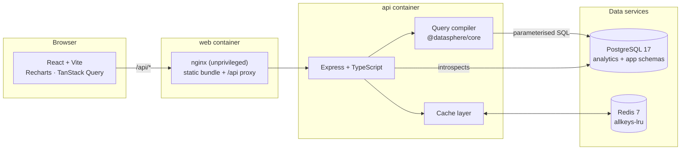

# DataSphere

A cloud data visualization platform. Users compose analytical queries through a
UI — no SQL — and DataSphere compiles that JSON spec into parameterised SQL,
runs it against a 2-million-row PostgreSQL star schema, caches the result in
Redis, and renders it as live dashboard widgets.

> **Status: phases 1–5 of 7 complete.** The stack runs end to end: build a query
> in the UI, save it as a widget, and watch it update live when the data
> changes. Index/benchmark work and CI remain — see [Roadmap](#roadmap).

---

## Architecture



The **query compiler** is the security boundary. It lives in
`packages/core` as a pure, dependency-free function: a JSON query spec goes in,
`{ text, values }` comes out. Table and column names are validated against an
allowlist derived from introspecting the database, and every user-supplied
value becomes a bind parameter. Nothing is string-concatenated.

Schemas are split for the same reason:

| Schema      | Contents                                                              | Reachable by the query engine                  |
| ----------- | --------------------------------------------------------------------- | ---------------------------------------------- |
| `analytics` | `fact_orders`, `dim_date`, `dim_customer`, `dim_product`, `dim_store` | yes — the catalog introspects this schema only |
| `app`       | `dashboards`, `widgets`                                               | no                                             |

Application tables are structurally unreachable from a user-composed query,
independent of the allowlist check.

---

## Quick start

Requirements: Docker with Compose v2.

```bash
git clone https://github.com/kp-krish/DataSphere.git
cd DataSphere
cp .env.example .env
docker compose up --build
```

Then open <http://localhost:5173>.

Boot order is enforced with healthchecks, not sleeps:

```
postgres + redis  →  init (migrate + seed)  →  api  →  web
```

The `init` service runs migrations, generates 2M rows, and exits. The API waits
on `service_completed_successfully`, so it never starts against an unmigrated
or unseeded database. First boot takes roughly a minute; subsequent boots reuse
the volume and skip seeding entirely.

For a faster first run, seed less data:

```bash
SEED_FACT_ROWS=100000 docker compose up --build
```

### Local development

```bash
npm install
docker compose up -d postgres redis   # data services only
npm run migrate
npm run seed
npm run dev:api                       # http://localhost:4000
npm run dev:web                       # http://localhost:5173
```

---

## Dataset

A classic Kimball star schema modelling e-commerce order lines.

| Table          | Rows      | On disk |
| -------------- | --------- | ------- |
| `fact_orders`  | 2,000,000 | 249 MB  |
| `dim_customer` | 50,000    | 7.5 MB  |
| `dim_product`  | 5,000     | 1.1 MB  |
| `dim_date`     | 1,826     | 288 kB  |
| `dim_store`    | 200       | 72 kB   |

The generator is deliberately not uniform, because uniformly random data makes
every filter equally selective and produces benchmark numbers that do not
survive contact with real data:

- **Power-law popularity** for customers, products and stores
- **Seasonality**: monthly and weekday demand curves over 18% compounding
  annual growth, so time series show a real trend and date-range filters vary
  in selectivity
- **Price-coherent measures**: cost clusters around per-subcategory means and
  quantity scales inversely with price. Office Supplies leads on line count and
  trails on revenue; Technology inverts it.
- **Deterministic**: a given `SEED_RANDOM_SEED` reproduces the identical
  dataset on any machine, so benchmark runs are comparable

Loading uses `COPY FROM STDIN` streamed under backpressure at ~190k rows/s in
the container, with foreign keys dropped for the load and restored afterwards.

---

## Caching

Query results are cached in Redis under a key derived from the _normalised_
query spec, so two specs that mean the same thing share one entry — filters are
ANDed, for instance, so their order is sorted away before hashing.

Every response reports what the cache did, which is what makes the performance
claim checkable rather than asserted:

```jsonc
"meta": {
  "cache": "hit",          // hit | miss | bypass | disabled
  "executionMs": 0,        // Postgres was not touched
  "totalMs": 2.12,
  "savedMs": 317.12,       // what this hit actually saved, measured
  "cacheTtlRemaining": 287,
  "generation": 13
}
```

### Invalidation is O(1)

Each dataset carries a generation counter, and the generation is folded into
every cache key. Invalidating is a single `INCR`: every key written under the
old generation becomes unreachable at once, because nothing will ever compute
that key again. Orphans expire on their own TTL, or sooner under Redis's
`allkeys-lru`. No `SCAN`, no per-table key sets to keep in step.

Generations are held in process (they sit on the query hot path) and kept
current three ways: read at startup and on every Redis reconnect, pushed over
pub/sub the instant any instance invalidates, and re-read on a 30s timer as a
backstop for messages missed during an outage. If all three fail the worst case
is bounded — a cached result served until its own TTL expires, which is the
staleness the TTL already permits.

### Live updates

The same pub/sub feed drives `GET /api/events`, a Server-Sent Events stream.
When a dataset is invalidated, connected browsers are told immediately and
refetch — rather than every widget polling on a timer for data that has not
changed. `POST /api/demo/orders` appends synthetic order lines and invalidates
in the same request, which makes the whole loop demonstrable.

The cache is never load-bearing: every path through it degrades to "run the
query" when Redis is unavailable, and the response says `disabled` rather than
pretending the cache was consulted.

---

## Frontend

React + Vite + TypeScript, Recharts for charts, TanStack Query for server
state, dnd-kit for reordering.

**The chart palette was computed, not chosen.** Eight hues in a fixed order,
validated against this app's dark surface with a colour-vision checker:

| Check                                          | Result                                          |
| ---------------------------------------------- | ----------------------------------------------- |
| Adjacent pairs, all 8 slots (bar, line, stack) | worst CVD ΔE **8.6**, normal-vision ΔE **19.3** |
| All pairs, first 4 slots (pie)                 | worst CVD ΔE 6.9, normal-vision ΔE **19.3**     |
| Contrast against the surface                   | all 8 slots ≥ 3:1                               |

The obvious default ordering was unusable: it places yellow beside orange,
which measures normal-vision ΔE 10.6 when every slice is compared with every
other — below the floor of 15, meaning readers with full colour vision cannot
reliably tell two pie slices apart. The order here was found by validating
candidate orderings and keeping only ones that pass. Pie slices are
direct-labelled because the first four slots land in the band where colour
needs a second channel.

Other rules the UI holds to:

- **Text never wears a data colour.** A coloured swatch beside a label carries
  identity; the label stays ink.
- **Every chart has a table view** — the accessible twin, reachable from the
  widget header, so no value is locked behind colour or hover.
- **Refetch holds the previous render** at reduced opacity rather than flashing
  a skeleton and jumping the layout.
- **Reordering works from the keyboard** (dnd-kit's keyboard sensor), and is
  optimistic with a rollback if the server rejects it.
- Bars cap at 24px, lines are 2px, markers carry a 2px surface ring, and
  gridlines are solid hairlines one step off the surface.

---

## Repository layout

```
packages/core     Shared contracts + the query compiler. Zero runtime deps,
                  so it is exhaustively unit-testable without a database.
apps/api          Express + TypeScript REST API, and the migrations.
apps/web          React + Vite client.
scripts           Seeding and the benchmark harness.
```

---

## Configuration

All settings come from the environment and are validated at boot — the API
either starts with a fully typed, valid config or refuses to start. See
[`.env.example`](.env.example) for the annotated list. The ones that matter:

| Variable            | Default   | Purpose                                                        |
| ------------------- | --------- | -------------------------------------------------------------- |
| `QUERY_MAX_ROWS`    | `10000`   | Hard ceiling on rows per query; clamps any client-side `LIMIT` |
| `QUERY_TIMEOUT_MS`  | `15000`   | `statement_timeout` applied to every analytical query          |
| `CACHE_TTL_SECONDS` | `300`     | Redis TTL for cached query results                             |
| `SEED_FACT_ROWS`    | `2000000` | Fact rows to generate                                          |

No secrets are committed. `.env` is gitignored; only `.env.example` ships, and
its values are throwaway local-container credentials.

---

## Roadmap

- [x] **1** — Scaffold, compose stack, migrations, 2M-row seed
- [x] **2** — Schema catalog + query compiler + injection tests
- [x] **3** — REST API: catalog, query execution, dashboard/widget CRUD
- [x] **4** — Redis caching, invalidation, hit/miss reporting
- [x] **5** — Query builder UI, dashboard grid, all widget types
- [ ] **6** — Indexes, benchmark harness, `BENCHMARKS.md`
- [ ] **7** — CI, docs, polish

## Screenshots

Regenerate with `npm run screenshot` against a running stack.

### Dashboard

Every widget type on one board — KPI tiles, a bucketed time series, a pie, a
grouped bar, a multi-series bar and a data table. Each card reports its own
cache status and what the cache saved.


### Query builder

Pick a dataset, dimensions, measures, filters and sort. The generated SQL is
compiled **by the server** and shown live, with the bound values listed
separately — so it is visible that no value is ever in the SQL text.


## Benchmarks

_Added in phase 6. Numbers will be whatever the runs actually produce, measured
on stated hardware under the Postgres configuration pinned in
`docker-compose.yml`._
